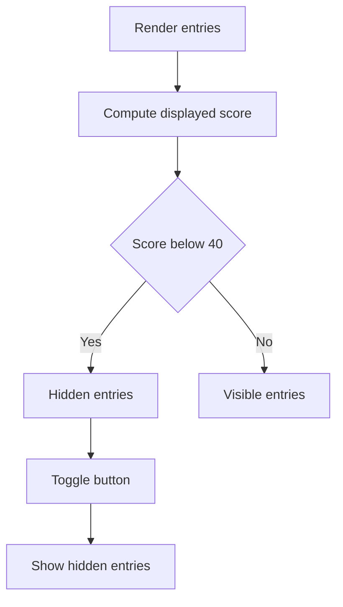

# Plan: Collapse <40% models behind Show More toggle

## Goals

- Hide models scoring under 40% by default and reveal them with a per-section toggle.
- Apply to both leaderboard views: full table and simple leaderboard.
- Cutoff uses the currently displayed score (best vs average) when in success view.

## Proposed UX

- Add a button at the bottom of each section: `Show more (N)` toggling to `Show less`.
- Buttons appear only when there are hidden entries under 40% for that section.

## Implementation Steps

1. Introduce a shared cutoff constant (40) and toggle label helper in the leaderboard components.
2. Update full leaderboard table:
   - Split `sortedEntries` into `visibleEntries` (>= 40) and `hiddenEntries` (< 40) using `entry.percentage`.
   - Add local state `showMore` to switch between rendering only visible entries vs both.
   - Render the toggle button below the desktop table and below the mobile card list.
3. Update simple leaderboard success view:
   - Use the currently displayed score (`getScorePercentage`) for cutoff.
   - Split ranked entries into visible vs hidden.
   - Apply the split to the bar chart list and the simple table list.
   - Add the toggle button below each section.
4. Decide scope for speed/cost views:
   - Default to no cutoff because values are not percentages; leave unchanged.
5. Verify counts and labels:
   - `Show more (N)` uses the hidden count for that section.
   - Toggle hides again with `Show less`.

## Mermaid Flow

## Files to Change

- components/leaderboard-table.tsx
- components/simple-leaderboard.tsx
